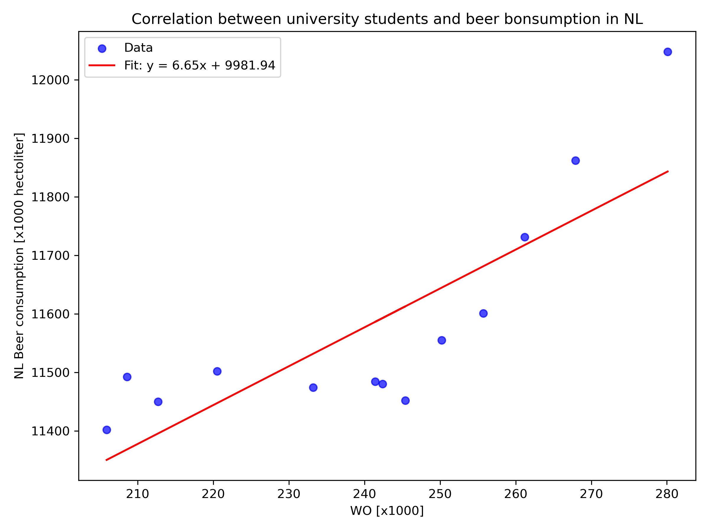

# student number: 
14639491

# paper titles
- The rise of *Coccidioides*: Forces against the dust devil unleashed
- An analysis of the forces required to drag sheep over various surfaces
- The neurocognitive effects of alcohol on adolescents and college students

# plot and interpretation 

The scatter plot shows a clear positive correlation between the number of university graduates (WO) and beer consumption in the Netherlands. The regression line has a slope of 6.65, meaning that for every 1,000 additional graduates, beer consumption rises by 6,650 hectoliters. This suggests that student drinking habits could contribute in part to the pattern. However, the relationship is likely not true overall there are many other social and demographic trends that influence national beer consumption. The dataset therefore illustrates the classic lesson that correlation does not necessarily imply causation, even if correlation is shown. 
